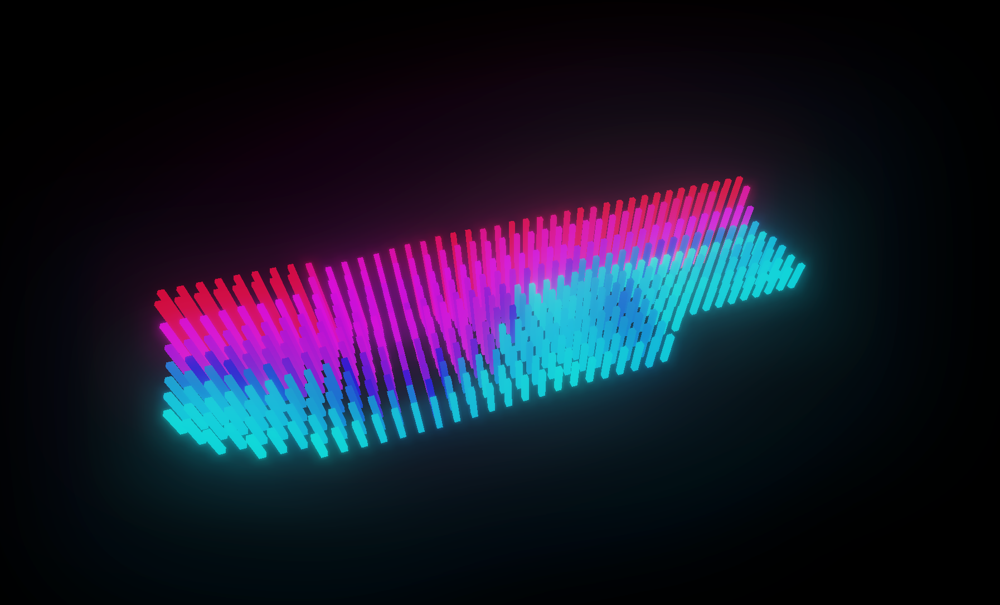
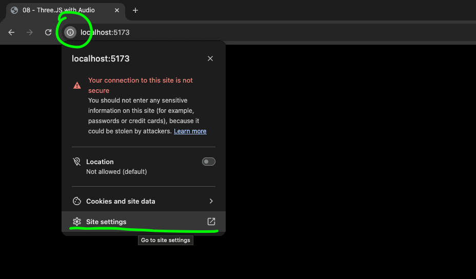
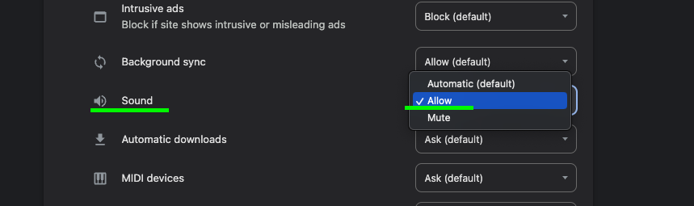
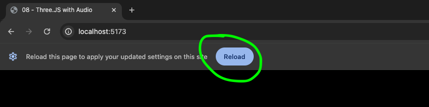

# audio-visualizer

## Setup Instructions

1. Clone this repository:

`git clone https://github.com/jonathgh/audio-visualizer.git`

2. Set up dependencies (THREE, Vite):

`npm install`

3. Run locally:

`npm run dev`

4. Open local dev server in Chrome

- Default: Local: http://localhost:5173/

5. In Chrome, audio won't play automatically, so make sure to allow Sound "always"

- click on the "i" next to the URL:
  
- Find the Sound settings, and set to always allow:
  
- Reload the page:
  

Sources / Inspiration:

[ThreeJS Example, Bloom Effect Pass](https://github.com/mrdoob/three.js/blob/master/examples/webgl_postprocessing_unreal_bloom_selective.html)

[Audio Visualizer Stream](https://github.com/simondevyoutube/ThreeJS_Tutorial_3DSound/blob/main/main.js)

More about the Audio Analyser: 

[Audio Analyser Documentation](https://threejs.org/docs/#api/en/audio/AudioAnalyser)

[Web Audio API Analyser Node](https://developer.mozilla.org/en-US/docs/Web/API/AnalyserNode)

[Web Audio API FFT Data](https://developer.mozilla.org/en-US/docs/Web/API/AnalyserNode/getByteFrequencyData)

